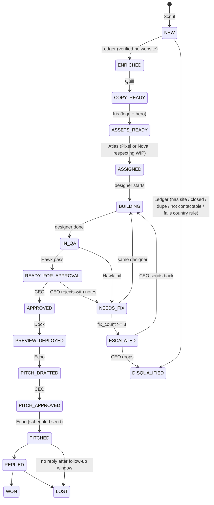
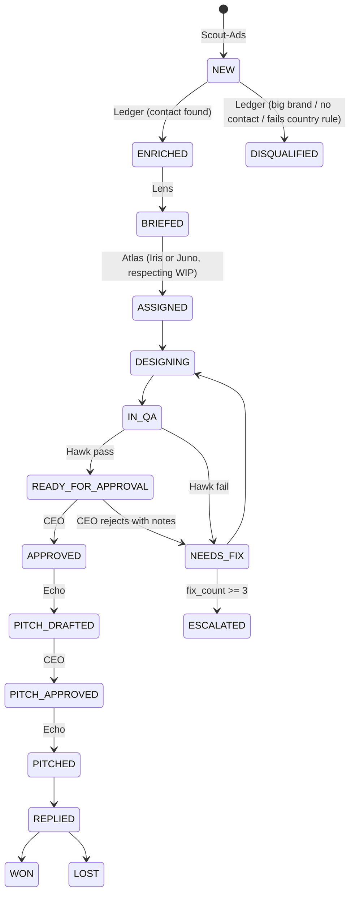

# Wots Office — Build Spec

> Hand this file to Claude Code (save it as `docs/SPEC.md` in a new repo) and ask it to build **Phase 0** first. Each phase has acceptance criteria. Do not start a phase until the previous one passes.

## 1. What we're building

Wots Office is an AI-agent "office" that finds small businesses, produces work for them on spec, and pitches that work by email. The CEO (Lyndon) approves everything before it leaves the building.

There are two scopes (pipelines) that share one task board, one orchestrator, one QA agent, one approval dashboard and one outreach agent:

| Scope | Target | What we make | Pitch |
|---|---|---|---|
| `website` | Businesses with **no website** | A ready-made website | "We built you a site — here's the preview" |
| `ad_refresh` | Small businesses **running social ads** with weak creative | 2–3 redesigned ad variations | "Fresh variations you could A/B test" |

Target countries (v1): **US, UK, AU**. NZ is excluded as a target, but NZ law still applies to us as the sender (see §9).

## 2. Design principles

1. **One source of truth.** Agents never pass files to each other. Every lead is a row on the board with a `status`. Each agent only picks up leads in the status it owns and moves them forward.
2. **Atlas (the orchestrator) is plain Python, not an LLM.** Routing, assignment, limits and escalation must be deterministic and testable. LLMs do the creative and extraction work inside agents.
3. **Humans gate anything external.** Nothing is deployed publicly or emailed without CEO approval. `auto_send` is `false` by default and stays that way until Phase 6.
4. **Everything is logged.** Every status change writes an `events` row (who, from, to, why).
5. **Config over code.** Country rules, WIP limits, models, thresholds and daily caps live in YAML.
6. **Dry-run first.** A global `DRY_RUN=true` mode means no external sends, no deploys and no paid API calls beyond a cap.

## 3. Tech stack

- **Language:** Python 3.12
- **DB:** SQLite via SQLAlchemy 2.x + Alembic (designed so we can swap to Postgres later)
- **LLM:** Anthropic Python SDK (Messages API). Model per agent set in `config/agents.yaml` — default a fast model for extraction/classification and a stronger model for copy, briefs and design.
- **Browser automation / QA:** Playwright (Python)
- **Performance/accessibility audits:** Lighthouse CLI (Node) called from Python
- **Images:** ad creatives are built as HTML/CSS templates and rendered to PNG with Playwright at exact sizes; Pillow for crops/compositing
- **Scheduler:** APScheduler (Atlas tick loop + timed email sends)
- **Dashboard:** FastAPI + Jinja2 + HTMX (local only, `localhost`)
- **Deploy previews:** Vercel CLI
- **Email:** provider behind an interface (`EmailProvider`), dev implementation writes `.eml` files to `data/outbox/`. Real provider chosen in Phase 4 (see §12 open decisions).
- **Notifications:** optional webhook (Telegram or Discord) when items hit the approval queue or get escalated

## 4. The team

| Agent | Scope | Job | Reads status | Writes status |
|---|---|---|---|---|
| **Atlas** | both | Orchestrator: assigns work, enforces WIP limits, retries, escalates, schedules | all | assignment/escalation states |
| **Scout** | website | Pulls leads from our existing scraper + Places API, filtered by country | — | `NEW` |
| **Scout-Ads** | ad_refresh | Ingests advertisers from ad-library captures (manual intake in v1) | — | `NEW` |
| **Ledger** | both | Verifies (no website / real + active business / entity type), dedupes, enriches contact details | `NEW` | `ENRICHED` or `DISQUALIFIED` |
| **Quill** | website | Writes all site copy (headline, about, services, CTA) in local spelling | `ENRICHED` | `COPY_READY` |
| **Lens** | ad_refresh | Analyses current ads, writes a creative brief | `ENRICHED` | `BRIEFED` |
| **Iris** | both | Graphic designer: logo + hero for websites; ad variations for ad_refresh | `COPY_READY` / `ASSIGNED` (ads) | `ASSETS_READY` / `IN_QA` |
| **Juno** | ad_refresh | Second graphic designer (different style profile) | `ASSIGNED` | `IN_QA` |
| **Pixel** | website | Web designer — style profile "clean & modern" | `ASSIGNED` | `IN_QA` |
| **Nova** | website | Web designer — style profile "bold & warm" | `ASSIGNED` | `IN_QA` |
| **Hawk** | both | QA for websites and ad creatives | `IN_QA` | `READY_FOR_APPROVAL` or `NEEDS_FIX` |
| **Dock** | website | Deploys approved sites to a private, noindexed Vercel preview | `APPROVED` | `PREVIEW_DEPLOYED` |
| **Echo** | both | Drafts personalised pitch emails with per-country rules; sends after approval | `PREVIEW_DEPLOYED` / `APPROVED` (ads) | `PITCH_DRAFTED` → `PITCHED` |
| **CEO** | both | Approves builds/designs and pitches in the dashboard | `READY_FOR_APPROVAL`, `PITCH_DRAFTED`, `ESCALATED` | `APPROVED`, `NEEDS_FIX`, `PITCH_APPROVED`, `DISQUALIFIED` |

Pixel/Nova share one `WebDesigner` class; Iris/Juno share one `GraphicDesigner` class. Instances differ only by name and style profile in `config/agents.yaml`. Adding a third designer should be a config change.

## 5. State machines

### 5.1 `website` scope



### 5.2 `ad_refresh` scope



Allowed transitions live in `wots/core/states.py` as a table per scope. `board.transition(lead_id, to_status, actor, note)` rejects anything not in the table.

## 6. Atlas (orchestrator) logic

Atlas runs a tick every N seconds (config, default 30s). On each tick:

1. **Dispatch**: for each enabled agent, find leads in the status it owns that are unclaimed, claim up to the agent's batch size, and run the agent. Claims use a lease (`claimed_by`, `claim_expires_at`) so a crashed agent's work is released automatically.
2. **Assignment with WIP limits**:
   - Designers have `max_wip: 2`.
   - `wip_mode: batch` (default, matches the CEO's rule): a designer gets new work only when **all** its current leads have reached `APPROVED` (or left the pipeline). With `wip_mode: rolling`, it gets a new lead whenever it has fewer than 2 active.
   - Active = `ASSIGNED`, `BUILDING`/`DESIGNING`, `IN_QA`, `NEEDS_FIX`, `READY_FOR_APPROVAL`, `ESCALATED`.
   - When both designers are free, assign to the one with fewer total leads this week (keeps the split even — this replaces "Ledger splits the list into two files").
3. **Fix routing**: a lead in `NEEDS_FIX` always goes back to its `assigned_to` designer with the latest QA report or CEO notes attached. Increment `fix_count`. At `fix_count >= 3` move to `ESCALATED`.
4. **Retries**: agent exceptions are retried with exponential backoff up to 3 times, then the lead goes to `ESCALATED` with the error in the note.
5. **Notify**: when anything enters `READY_FOR_APPROVAL`, `PITCH_DRAFTED` or `ESCALATED`, send a webhook notification (if configured).
6. **Budget guard**: if today's LLM spend exceeds `daily_llm_budget_usd`, pause all LLM agents and notify.

CLI:
```
wots run            # start Atlas loop + dashboard
wots tick           # run a single tick (for debugging)
wots import-leads leads.csv --scope website
wots status         # pipeline counts per status/scope
```

## 7. Agent specs

Every agent implements:
```python
class Agent(Protocol):
    name: str
    scope: set[str]
    owns_status: str
    def run(self, lead: Lead, ctx: AgentContext) -> AgentResult: ...
```
`AgentResult` = next status, note, artifacts created. Agents never call `transition` directly; Atlas applies the result.

### Scout (website)
- Input: country list, business categories, regions (config).
- Sources: adapter around **our existing scraper** (`integrations/existing_scraper.py` — Claude Code: ask Lyndon for the scraper's interface and wrap it) + Google Places API (Text Search) as a second source.
- Output: `NEW` leads with business name, category, address, phone, source URL, country, and `website_found` if the source already lists one (Ledger will disqualify those).
- Respect source terms of service and rate limits. Store `source` and `source_ref` for every lead.

### Scout-Ads (ad_refresh)
- **v1 is manual intake.** Lyndon drops ad-library page links and screenshots into `data/inbox/ads/` (or uploads in the dashboard) with a small YAML/CSV sidecar: page name, platform, ad library URL, country, notes.
- Scout-Ads normalises these into `NEW` leads plus `ad_captures` rows. **Do not build an automated scraper of Meta/TikTok/Google ad libraries** — it breaks their terms. Official APIs can be added later where they cover our countries.
- Targeting filters (stored as checklist fields, set during intake): small business, physical product, ad running 2+ weeks, DIY-looking creative.

### Ledger (both)
Verification:
- `website`: confirm no real website — check the Places `website` field, try DNS lookups on likely domains (`{name}.com`, `.co.uk`, `.com.au`), note social pages. Facebook/Instagram-only counts as "no website"; a real domain disqualifies.
- Dedupe by normalised name + phone + postcode.
- UK: look up **Companies House API**. Record `entity_type` (ltd, plc, llp, sole_trader, partnership, unknown).
- AU: look up **ABN Lookup** (web services GUID required). Disqualify if cancelled.
- `ad_refresh`: disqualify obvious big brands (config list + heuristics like many active ads across countries).

Enrichment: business description, contact name (if public), business email, phone in local format, timezone, social links. Only store business contact details — no personal data beyond what's needed to contact the business.

Apply country rules from §9 (e.g. UK non-corporate → `DISQUALIFIED` with reason `uk_consent_required`).

### Quill (website)
- Writes site copy JSON: `headline`, `subheadline`, `about`, `services[]`, `cta`, `seo_title`, `meta_description`.
- Local spelling (US vs UK/AU), local currency if prices appear.
- Must not invent facts (no fake reviews, awards, years in business, prices). If info is missing, write around it.

### Lens (ad_refresh)
Produces `brief.md` per lead using a fixed template:
- Product and offer
- Likely audience
- What the current ad does well
- What's weak (hook, hierarchy, text load, image quality, CTA, mobile legibility)
- Recommended hook(s) — 2–3 options
- Visual direction per variation
- Required formats: 1:1 (1080×1080), 4:5 (1080×1350), 9:16 (1080×1920)
- Brand elements to keep (logo, colours, product shots)

### Iris / Juno (graphic designers)
- `website` scope (Iris only by default): simple text-based logo + hero image/banner using brand-appropriate colours. Output PNG/SVG to the lead folder.
- `ad_refresh` scope: 2–3 variations per brief, each in all three sizes.
- Method: pick from `templates/ads/` HTML/CSS layouts, fill with copy + colours + the business's **real product photos** (from the captures), render to PNG with Playwright at exact dimensions. Do not generate fake product images.
- Output a `design_manifest.json` listing each file, size, variation and the hook used.

### Pixel / Nova (web designers)
- Build a single-page static site (HTML + CSS, Tailwind compiled or plain CSS; no build server needed) in `data/leads/{id}/site/`.
- Start from `templates/sites/` base templates (Claude Code: create 4–5, e.g. trades, food & hospitality, beauty & wellness, retail, professional services), then customise layout, colours and sections using Quill's copy and Iris's assets.
- Sections: hero, about, services, gallery (only if real images exist), contact (phone, email, address, map link), footer.
- Must include `<meta name="robots" content="noindex">` while in preview.
- Mobile-first, responsive, accessible.

### Hawk (QA)
Website checks (Playwright + Lighthouse):
- Loads with no console errors at 375, 768 and 1440 px widths; save screenshots for the dashboard
- No broken links or missing images
- Phone/email/address match the lead record exactly
- No placeholder text (`lorem`, `[Business Name]`, `TODO`, `example.com`)
- Lighthouse thresholds (config): accessibility ≥ 90, performance ≥ 80, SEO ≥ 80 (SEO check ignores noindex)
- LLM proofread pass for spelling/grammar in the correct locale
- `noindex` present

Ad checks:
- Exact pixel dimensions for every file in the manifest
- Minimum font size and text contrast (WCAG AA) for key text
- Text doesn't cover too much of the image (config threshold)
- Logo and real product image present
- Spelling/grammar pass

Output: `qa_report.json` with `passed`, and `issues[]` (each with severity, description, where, suggested fix). Any `high` issue = fail.

### Dock (website)
- Deploys `site/` to a Vercel preview URL with noindex. One project per lead, or one project with per-lead paths (open decision §12).
- Stores the preview URL on the lead.
- Previews are torn down after `preview_ttl_days` if the lead is `LOST`.

### Echo (both)
- Drafts a short, personalised email using `templates/email/{scope}.md` plus LLM personalisation (1–2 specific lines about the business).
- `website`: includes the preview link and 1–2 screenshots.
- `ad_refresh`: includes a before/after image (their current ad next to our best variation, watermarked) — frame as "variations you could A/B test", never "your ads are bad".
- Applies the country rules profile (§9): footer, sender identity, postal address, opt-out wording.
- Checks the suppression list before drafting and again before sending.
- After CEO approval, schedules the send for the recipient's local business hours (Tue–Thu, 9–11am by default) and respects `daily_send_cap`.
- One follow-up after `followup_after_days` if no reply, then `LOST`. No further contact.
- Replies: v1 = CEO marks `REPLIED` / `WON` / `LOST` in the dashboard. Any reply containing an opt-out phrase → suppression list immediately.

## 8. Data model

```
leads
  id, scope, status, business_name, category, description,
  country, region, timezone, address, phone, email, contact_name,
  website_found, social_links(json), entity_type, registry_id,
  source, source_ref, assigned_to, fix_count,
  claimed_by, claim_expires_at, preview_url,
  disqualify_reason, created_at, updated_at

ad_captures      id, lead_id, platform, ad_library_url, screenshot_paths(json),
                 ad_copy, first_seen, checklist(json), notes
artifacts        id, lead_id, kind[copy|brief|logo|hero|site|ad_variant|qa_report|pitch],
                 path, version, created_by, created_at
qa_reports       id, lead_id, artifact_version, passed, issues(json), created_at
approvals        id, lead_id, kind[build|pitch|escalation], decision, notes, decided_at
outreach         id, lead_id, kind[initial|followup], subject, body, scheduled_for,
                 sent_at, status, provider_message_id
suppression      id, email, domain, reason, added_at
events           id, lead_id, from_status, to_status, actor, note, ts
llm_usage        id, agent, model, input_tokens, output_tokens, cost_usd, lead_id, ts
```

Files on disk: `data/leads/{lead_id}/` → `copy.json`, `brief.md`, `assets/`, `site/`, `ads/`, `qa/`, `pitch/`.

Retention: leads that end `LOST` or `DISQUALIFIED` are purged of contact details after `retention_days` (default 180); suppression entries are kept forever.

## 9. Country rules (config/countries/*.yaml)

Not legal advice — the CEO will review each regulator's guidance (FTC, ICO, ACMA) before live sending. NZ's Unsolicited Electronic Messages Act also applies because we send from NZ: always identify the sender and include a working unsubscribe.

```yaml
# config/countries/us.yaml
code: US
spelling: en-US
currency: USD
phone_format: "(XXX) XXX-XXXX"
channels_allowed: [email]          # no automated calls/SMS
contactable_entity_types: [any]
require_postal_address: true
require_unsubscribe: true
unsubscribe_honor_days: 10
send_window_local: {days: [TUE, WED, THU], start: "09:00", end: "11:00"}
```
```yaml
# config/countries/uk.yaml
code: UK
spelling: en-GB
currency: GBP
phone_format: "+44 XXXX XXXXXX"
channels_allowed: [email]
contactable_entity_types: [ltd, plc, llp]   # sole traders & partnerships need prior consent → disqualify
require_postal_address: true
require_unsubscribe: true
require_source_disclosure: true            # say where we found their details
send_window_local: {days: [TUE, WED, THU], start: "09:00", end: "11:00"}
```
```yaml
# config/countries/au.yaml
code: AU
spelling: en-AU
currency: AUD
phone_format: "+61 X XXXX XXXX"
channels_allowed: [email]
contactable_entity_types: [any]
require_conspicuous_publication: true      # email must be publicly listed by the business
require_unsubscribe: true
unsubscribe_honor_days: 5
send_window_local: {days: [TUE, WED, THU], start: "09:00", end: "11:00"}
```

Sending hygiene (settings.yaml): separate sending domain, SPF/DKIM/DMARC set up, `daily_send_cap` starting at 20 and raised slowly.

## 10. CEO dashboard (localhost)

Pages:
- **Pipeline**: counts per scope × status, per-designer load, today's LLM spend.
- **Approval queue**: side-by-side view — website in an iframe with the 3 viewport screenshots, or ad variations with the original ad next to them. Shows Hawk's report. Buttons: Approve / Reject with notes (→ `NEEDS_FIX`) / Disqualify.
- **Pitch queue**: rendered email, editable before approval. Approve / Edit / Reject.
- **Escalations**: reason, history, actions.
- **Lead detail**: full timeline from `events`, all artifacts.
- **Intake**: upload ad captures (Scout-Ads) and CSV lead imports.
- **Suppression list**: view/add.
- **Replies**: mark `REPLIED` / `WON` / `LOST`.

## 11. Repo layout

```
wots-office/
  docs/SPEC.md
  config/settings.yaml  config/agents.yaml  config/countries/{us,uk,au}.yaml
  wots/
    core/      db.py models.py states.py board.py atlas.py llm.py config.py cli.py
    agents/    scout.py scout_ads.py ledger.py quill.py lens.py
               graphic_designer.py web_designer.py hawk.py dock.py echo.py
    integrations/ existing_scraper.py places.py companies_house.py abn.py
                  vercel.py email_provider.py notify.py lighthouse.py
    dashboard/ app.py templates/ static/
  templates/  sites/ ads/ email/
  data/       wots.db leads/ inbox/ outbox/
  tests/
  .env.example   # ANTHROPIC_API_KEY, GOOGLE_PLACES_KEY, COMPANIES_HOUSE_KEY, ABN_GUID, VERCEL_TOKEN, EMAIL_PROVIDER_KEY, NOTIFY_WEBHOOK
```

## 12. Build phases

**Phase 0 — Skeleton**
Repo, config loading, DB models + migrations, state tables, `board.transition`, Atlas tick loop with claims/leases, WIP logic, events log, CLI, `DRY_RUN`.
✅ Unit tests cover every allowed/blocked transition, batch vs rolling WIP, fix-count escalation and lease expiry. `wots status` works.

**Phase 1 — Website pipeline (no scraping, no email)**
CSV lead import → Ledger (enrichment only) → Quill → Pixel/Nova → Hawk → dashboard approval queue.
✅ 4 sample leads flow to `APPROVED`; a deliberately broken site gets `NEEDS_FIX`, is fixed and re-passes; designers never exceed WIP 2.

**Phase 2 — Real leads**
Scout with existing scraper + Places API; Ledger verification, dedupe, Companies House, ABN Lookup, country rules.
✅ 50 real leads per country ingested; UK sole traders disqualified with reason; businesses with real domains disqualified.

**Phase 3 — Assets & previews**
Iris logo/hero feeding the web designers; Dock Vercel previews with noindex and TTL cleanup.
✅ Approved sites get working preview URLs; previews are not indexable.

**Phase 4 — Outreach (manual send)**
Echo drafting, country footers, suppression list, pitch approval queue, scheduling, email provider integration. `auto_send=false`: approved pitches go to `data/outbox/` or are sent only after a second explicit "Send" click.
✅ Pitches render correctly for US/UK/AU; suppressed addresses can't be drafted or sent; sends land in the recipient's local window.

**Phase 5 — Ad Refresh scope**
Intake page, Scout-Ads, Lens briefs, Iris/Juno HTML→PNG variations in 3 sizes, Hawk ad QA, before/after pitch.
✅ 3 sample advertisers flow to `PITCH_DRAFTED` with correct sizes and a passing QA report.

**Phase 6 — Hardening**
Cost tracking dashboard, budget guard, retries, notifications, follow-ups, retention purge, metrics (reply rate and win rate per scope/country/designer).

## 13. Open decisions (ask the CEO)

1. Interface of our existing scraper (input/output format).
2. Email provider — note many transactional providers (e.g. those built for receipts/notifications) forbid cold outreach in their terms; pick one that allows B2B prospecting.
3. Public unsubscribe link: v1 uses "reply 'unsubscribe'" + `List-Unsubscribe: mailto:`. Later, a tiny public endpoint on Vercel.
4. Vercel: one project per lead vs one shared project with paths.
5. Pricing per market (USD/GBP/AUD) to mention in pitches.
6. Physical postal address to use in email footers.
7. Default model per agent and daily LLM budget.
